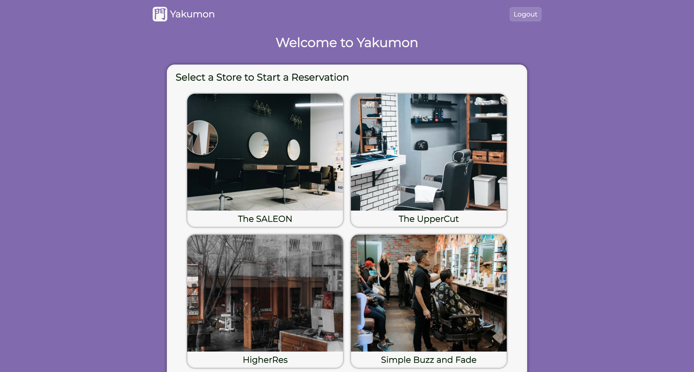

# Yakumon Frontend

Click the image if you wish to visit the site.

---

This app was created to solve many issues store owners and stylists have regarding current scheduling apps on the market.

Yakumon allows stores and stylists to quickly link customers directly to their appointment system, whether from their store website or other outlets like Instagram. Users can quickly and easily sign up, select a service they wish to schedule, and make the appointment. Available appointment blocks are clearly displayed to the user and they can select as they wish.

The power behind this application is where store owners can easily create, update, and delete their stores. They can also handle their employees from the rear portal. Stylists can then quickly see their schedule, past and future, and make changes to the appointments as they see fit. They can also add appointments for their customers.

## Technologies

- React
- Typescript
- Styled-Components
- Date-Fns
- React-DOM/React-Router-DOM

### Features

- User interface is quick and easy to navigate.
- Mobile-first styling and feature implementation.
- Very flexible CRUD front-end with user, store, appointment models.
- Styled-Components offers the ability for diverse theming and great flexibility in usable styled components across the entire app.

### Challenges Faced

#### - Heavy data checking and manipulation.

Yakumon operates based on data received from the backend API.
When a user or stylists looks at the available schedule, the application:

1. Builds an empty schedule using store hours and employee time off.
2. Creates a list of displayable date and time labels from an empty schedule.
3. Calls API for data.
4. Empty schedule is flipped from an array of objects of hours to an array of objects of days.
5. Previously made appointments are compared, added to the empty array.
6. When an open time block is found, the application counts the continuing time blocks to fulfill service time period.
7. If met, schedule is allowed to be chosen; if not met, is disallowed.
8. Array is switched again to an array of objects of hours to benefit JSX output.
9. Once displayed, user is allowed to click available time slots.
10. A chosen time slot is sent to the backend API to create the appointment.

#### - Authorized areas

Select users can quickly and easily navigate the site based on their privileges. Normal users cannot create stores without admin approval, stylists cannot operate without store owner approval. Once approved, they are allowed to enter areas where they can create, alter, and delete as they wish. All of this is made possible with React-Router-DOM.

#### - Layered CRUD

Normal users are offered a very straight-forward system of creating appointments.
Store owners can create stores, update store info, add employees, and delete both store and employees (from the store).
Stylists can create, alter, and delete appointments. They can also create, alter, and delete services they offer.
